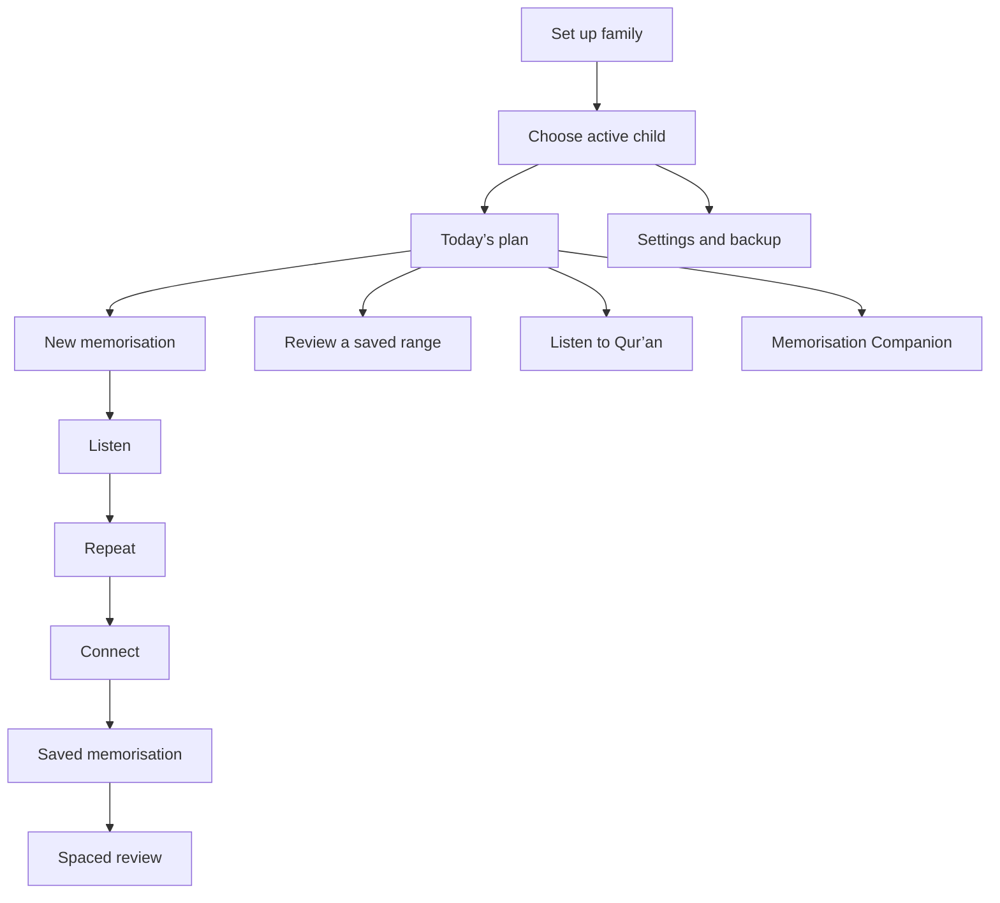

# Wali Tahfiz — Product and Design Guide

## What this app is for

Wali Tahfiz helps families build a warm Qur’an memorisation habit at home. It starts with Al-Fatihah and Juz 30. A parent or guardian stays in charge of the session; the app simply makes the next small step clear.

The goal is not to collect the most memorisation. The goal is for a child to feel safe, supported, and close to the Qur’an.

## People we design for

- **Parent or guardian:** sets up the family, chooses a child, creates targets, plays audio, and records how a session went.
- **Child:** has a separate profile, memorised ranges, targets, repeat settings, and review schedule.

One family can have more than one child. Switching the active child must never show another child’s targets or memorisation by mistake.

## Product rules

1. Be kind, never demanding. A tired or upset child can pause without losing progress.
2. Prefer one short action over a long to-do list.
3. Help the adult lead the session. Do not try to replace their voice, judgement, or care.
4. Make today’s plan and the next action easy to see.
5. Keep personal data on the device by default.
6. Work well on a phone first, then use extra tablet and desktop space thoughtfully.

## Main journey

## Key screens and features

| Screen | What it does |
| --- | --- |
| Family setup | Choose how the adult is addressed, add one or more children, select each child’s icon, age, and surahs already memorised. A JSON backup can also be restored here. |
| Home | Shows the active child, today’s targets, progress counts, saved memorisation, reviews that are ready, audio shortcut, Settings, and the Memorisation Companion. |
| Add target | Creates either a new memorisation target or a review target. A new target can be one verse or a valid verse range. |
| New memorisation | Leads the family through Listen, Repeat, and Connect. The current place is saved so the family can stop and return later. |
| Review | Shows a random verse and the next verse. The guardian can play either one, shuffle the prompt, then record whether it was smooth or needs another try. |
| Listen to Qur’an | Provides Al-Fatihah and Juz 30, Arabic text, translation, reciter choice, per-verse repeat, range playback, and playback controls. |
| Memorisation Companion | Asks about the child’s mood and offers one small, gentle action: pause, listen, review, start a target, or make a new target. Local advice always works; AI advice is optional. |
| Settings | Manages language, light/dark theme, guardian greeting, child profiles, practice repeats, reciter, backup import/export, welcome prompt, and full local-data reset. |

## New memorisation flow

Keep the session short and clear. For each verse, use these three steps:

| Step | Plain-language instruction | Behaviour |
| --- | --- | --- |
| Listen / talaqqi | Listen to the reciter together. | Plays the verse for the child’s configured number of repeats. |
| Repeat / tikrar | The adult reads slowly; the child repeats. | The adult taps the counter after each round. |
| Connect / rabt | Help the child join the verses together. | Used after later verses and again for a completed surah range. |

The app lets each child have their own repeat count for these steps. A one-verse target can finish after the Repeat step. For long surahs, Connect is split into blocks of up to ten verses, with a small joining step between blocks.

The family can choose **Finish for today** at any point. Keep the session state and let them resume it later. Do not use failure language.

When a new target is complete, save it as a memorised range for that child. If the child has now covered a full surah through saved ranges, offer a full-surah connection practice first.

## Review and spacing

Each saved range gets a simple spaced review schedule:

`1 day → 3 days → 7 days → 14 days → 30 days`

- **Smoothly done** moves the range to the next interval.
- **Try again** starts the interval again from the beginning.
- Use friendly labels such as “Ready to review” and “In 3 days.” Never say “overdue” or imply failure.
- Offer only a small number of review suggestions at once. The adult can add one to today’s plan.

In review, show the question verse and then the next verse as the answer. Give the child time before revealing or playing the answer. A one-verse range should explain that it has no following verse rather than showing a broken state.

## Listening experience

The listening page covers Al-Fatihah and all of Juz 30. It should:

- Search by surah number, Latin name, or Arabic name.
- Show Arabic text right-to-left and a translation in the selected app language.
- Let the user choose a reciter. Ayman Sowaid is the default.
- Let the user repeat each verse 1, 2, 3, or 5 times.
- Let the user turn on a verse range, choose its start and end, and repeat that range 1, 2, 3, or 5 times.
- Offer play/pause, previous, next, and replay controls with a clear active state.
- Include Bismillah before applicable surahs and continue through the next Juz 30 surah when ordinary playback reaches the end.
- Save listening choices on the device.

Qur’an text, translations, and audio need an internet connection. The installed app shell can still open offline.

## Memorisation Companion

The companion starts from the child’s present condition, not a productivity target. Supported check-ins include upset, not in the mood, wants to play, tired, and ready to learn.

| Situation | Helpful response |
| --- | --- |
| Upset, tired, or not ready | Suggest a pause, calm presence, or a cuddle. Do not suggest a new target. |
| Wants to play | Suggest gentle recitation in the background. |
| Review is ready | Suggest one short range to review. |
| No memorisation yet | Suggest 1–2 verses of Al-Fatihah. |
| Child is ready | Suggest only one suitable next action. |
| Today is complete | Appreciate the effort and keep any next action light. |

The local recommendation must always be useful. If `OPENAI_API_KEY` is present on the server, the app can request a short personalised version from `/api/daily-coach`. The AI must use the same action chosen by the local rule, stay brief, avoid diagnoses and guilt, and never tell users it is AI. If the request fails, keep showing local advice.

## Data, backup, and privacy

Use IndexedDB for the family profile, child profiles, daily targets, memorised ranges, listening preferences, language, and companion check-ins. Session-only practice routing may use session storage.

The app should keep data separated by child ID. Deleting a child removes that child’s targets, saved memorisation, and check-ins only after clear confirmation.

Provide JSON export and import so a family can move to another device. Validate imports before writing them. A full reset needs a confirmation and must make it clear that an export is the only way to keep a copy.

By default, no family data is sent to an app server. Qur’an text, translations, and reciter audio come from public Qur’an services as needed. Optional AI advice is the only feature that contacts the app’s server endpoint; the API key stays in the server environment.

## Language, theme, and installation

- Support Bahasa Indonesia and English throughout the interface.
- Save the chosen language on the device; `VITE_APP_LOCALE` can set the first default to `id` or `en`.
- Offer light and dark themes and save the choice on the device.
- Make the browser install prompt easy to understand, including clear iOS “Add to Home Screen” instructions.
- Cache the app shell so an installed app can open without a network connection. Be honest when Qur’an text or new audio still needs internet access.

## Visual direction

The interface should feel calm, warm, and grown-up enough for the guardian without becoming dull for a child.

- Use forest green for the main action and sense of calm.
- Use soft sage for success and quiet selection.
- Use cream for the page background.
- Use peach and terracotta for warm accents and gentle attention.
- Use clear, high-contrast body text. Do not make colour the only way to explain status.
- Use Fredoka for friendly headings, DM Sans for interface text, and a readable Arabic font for verses.
- Give Arabic generous size, line height, and right-to-left direction.
- Use large rounded cards, generous space, and touch targets of at least 44 × 44 px.
- Keep one main action visible in each focused area.
- Avoid leaderboards, streak pressure, aggressive red warnings, or language that makes a family feel guilty.

## Responsive and accessible behaviour

| Width | Layout |
| --- | --- |
| Phone, under 640px | One column, 16px page padding, full-width cards, controls that can wrap, and bottom sheets for focused actions. |
| Tablet, 640px and above | More breathing room and optional two-column catalogue cards. |
| Desktop, 1024px and above | Home can use two columns: today’s plan and a narrower saved-memorisation panel. Keep focused practice screens comfortably narrow. |

Every icon-only button needs an accessible label. Dialogs need a title, clear close action, and correct dialog semantics. Use `aria-pressed` or `aria-selected` for selectable controls. Announce loading, audio, and error states in text. Respect reduced-motion preferences when adding animation.

## Practical acceptance checks

- A new guardian can add at least one child and arrive at the home screen without guessing what to do next.
- Each child sees only their own targets, memories, repeat settings, and check-ins.
- A target can be created in four choices or fewer: type, surah, range, save.
- Every practice step says what to do now and how far the family has come.
- Stopping a practice session does not lose its place.
- A completed new target becomes a saved range with a future review date.
- Review ends with one clear result: smooth or try again.
- Audio clearly shows what is playing and can be paused, replayed, or moved between verses.
- The companion never pushes a tired or upset child to continue.
- Backup import/export, language, theme, and reciter choices work without affecting another child’s learning data.
- The app remains comfortable at 320px wide and does not make Arabic text or audio controls scroll sideways.
