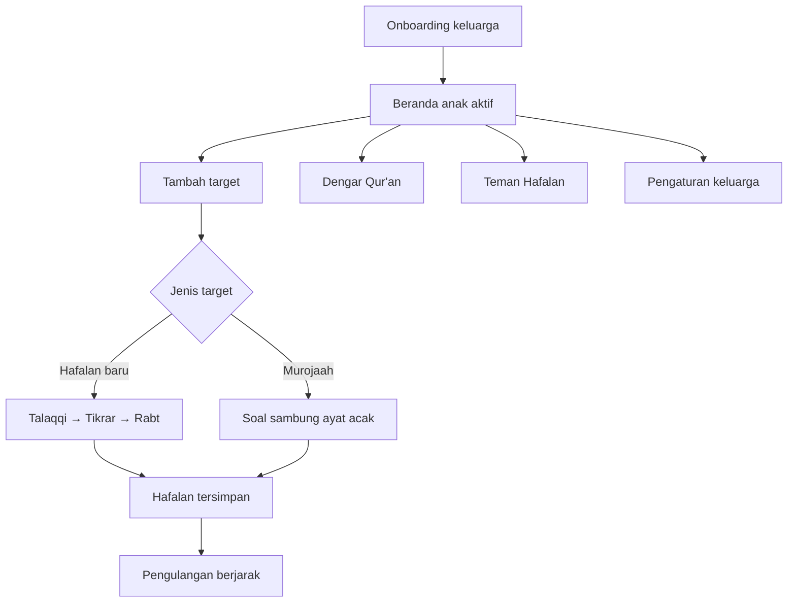

# Wali Tahfiz Corner — Design Direction

> Pendamping hafalan Al-Qur'an yang lembut, praktis, dan berpusat pada hubungan hangat antara wali dan anak.

## 1. Tujuan produk

Wali Tahfiz Corner membantu keluarga Indonesia membangun kebiasaan hafalan Al-Qur'an, terutama Al-Fatihah dan Juz 30, dalam sesi yang kecil dan menyenangkan. Aplikasi tidak dirancang untuk mengejar kuantitas hafalan; ia membantu wali hadir, memberi struktur sederhana, dan mengulang pada waktu yang tepat.

### Pengguna utama

- **Wali**: Ayah atau Ibu yang mendampingi latihan dan mengatur target.
- **Anak**: Dapat memiliki profil, hafalan, target, dan ritme pengulangan masing-masing.

### Prinsip desain

1. **Lembut, bukan menekan.** Bahasa tidak menyalahkan; anak boleh berhenti saat lelah atau rewel.
2. **Satu langkah kecil.** Satu target pendek lebih penting daripada agenda penuh.
3. **Wali memimpin sesi.** Aplikasi memberi panduan, audio, dan pencatatan—bukan menggantikan interaksi manusia.
4. **Kemajuan terasa jelas.** Status target, pengulangan, dan jadwal murojaah mudah dibaca dalam sekali lihat.
5. **Mobile-first dan tenang.** Kontrol besar, layar lapang, dan distraksi visual minimal mendukung penggunaan bersama anak.

## 2. Arsitektur pengalaman

| Area | Tujuan | Aksi utama |
| --- | --- | --- |
| Onboarding | Mengenali wali dan anak-anak yang didampingi | Pilih sapaan, tambah profil anak, tandai hafalan awal |
| Beranda | Menjadi pusat sesi hari ini | Tambah atau mulai target, lihat hafalan tersimpan |
| Hafalan baru | Memecah materi menjadi latihan lima menit | Dengarkan, ikuti, lalu sambungkan ayat |
| Murojaah | Menguatkan ingatan melalui recall | Jawab sambungan ayat, lalu tandai *Lancar* / *Butuh ulang* |
| Dengar Qur'an | Menemani aktivitas dengan murattal | Pilih surat/ayat, atur pengulangan dan rentang |
| Teman Hafalan | Memberi saran yang sesuai suasana anak | Pilih kondisi anak, lalu ambil satu saran ringan |
| Pengaturan | Mengelola keluarga dan ritme latihan | Ganti anak aktif, profil, hafalan, serta jumlah pengulangan |

## 3. Navigasi dan rute

| Rute | Layar | Catatan desain |
| --- | --- | --- |
| `/` | Beranda | Ringkasan target hari ini, daftar target, hafalan tersimpan, dan tombol bantuan mengambang |
| `/settings` | Pengaturan | Profil wali, daftar anak, pengaturan pengulangan per anak |
| `/audio` | Dengar Qur'an | Katalog surat, kartu ayat, audio berurutan, serta pengaturan rentang |
| `/talaqqi` | Tahap 1 | Dengarkan satu ayat berulang kali sebelum pindah tahap |
| `/tikrar` | Tahap 2 | Wali dan anak mengulang; penghitung memberi umpan balik konkret |
| `/rabt` | Tahap 3 | Anak menyambungkan rentang ayat sebelum target disimpan |
| `/murojaah` | Review | Kartu soal dan jawaban sambungan ayat yang diacak |

Navigasi kembali selalu terlihat di layar fokus. Dari beranda, pintasan **Dengar Qur'an** dan tombol **Tanya teman hafalan** tetap mudah dijangkau tanpa menutup konten inti.

## 4. Sistem visual

### Karakter

Visualnya hangat, natural, dan cukup dewasa untuk wali tanpa terasa kaku bagi anak. Permukaan terang, hijau hutan sebagai jangkar, dan aksen persik/terakota memberi rasa aman serta perayaan kecil. Hindari warna primer yang sangat jenuh, ilustrasi ramai, atau indikator yang bernada kompetitif.

### Token warna

| Token | Nilai | Peran |
| --- | --- | --- |
| `forest` | `#47775C` | Aksi utama, header, teks penting, status aktif |
| `sage` | `#DCEBDC` | Latar pilihan lembut dan penanda sukses ringan |
| `cream` | `#FFF9ED` | Latar halaman utama |
| `peach` | `#FFE5C4` | Badge, langkah pembelajaran, aksen hangat |
| `terracotta` | `#BD6F45` | Aksi sekunder, perhatian lembut, aksen nomor ayat |
| `slate` | Tailwind slate | Teks isi dan informasi pendukung |

Latar halaman memakai gradasi radial hijau pucat dan persik yang sangat halus. Kontras teks utama harus tetap memenuhi setidaknya WCAG AA.

### Tipografi

| Peran | Font | Penggunaan |
| --- | --- | --- |
| Display | Fredoka | Judul halaman, judul kartu, angka statistik |
| Body | DM Sans | Isi, tombol, label, dan navigasi |
| Arab | Serif sistem | Ayat Al-Qur'an; rata kanan, `dir="rtl"`, leading longgar |

- Judul layar: `30–36px`, display, hijau hutan.
- Judul bagian: `20–24px`, display.
- Isi: `14–16px`, line-height lega.
- Label kategori: `11–12px`, huruf kapital dengan tracking.
- Ayat Arab: `27–36px` pada layar biasa dan hingga `60px` pada layar latihan fokus.

### Bentuk, ruang, dan elevasi

- Radius utama: `24–32px` untuk kartu dan panel; `12–16px` untuk kontrol kecil.
- Ruang dasar: kelipatan `4px`; celah umum `12`, `16`, `20`, `24`, dan `32px`.
- Kartu memakai putih semi-transparan, garis putih/sage halus, dan bayangan hijau transparan yang rendah.
- Tombol memiliki tinggi sentuh minimal `44px`; tombol utama minimal `48px`.

## 5. Komponen inti

| Komponen | Aturan penggunaan |
| --- | --- |
| `glass-card` | Wadah utama dengan radius besar untuk grup informasi yang setara |
| Primary button | Hijau hutan, teks putih; hanya satu aksi dominan per area |
| Secondary button | Putih dengan garis sage; untuk kembali, dengarkan ulang, atau tindakan setara |
| Icon button | Kotak membulat 44px; wajib memiliki `aria-label` bila tanpa teks |
| Step label | Pil kecil berikon untuk menandai konteks, bukan sebagai pengganti heading |
| Target card | Menampilkan jenis, surat, rentang ayat, status, dan satu aksi lanjutan |
| Memory card | Menampilkan hafalan tersimpan, status jatuh tempo, dan aksi tambah murojaah |
| Ayah card | Nomor, teks Arab, terjemahan, dan status audio aktif; satu kartu = satu ayat |
| Bottom sheet / dialog | Untuk tambah target, konfirmasi penghapusan, atau fokus review; tutup dengan tombol eksplisit dan klik backdrop bila aman |
| Floating coach | Tombol mengambang kanan bawah; panel hanya dibuka atas permintaan pengguna |

## 6. Pola interaksi

### Membuat target

1. Wali menekan **Tambah** di agenda hari ini.
2. Pilih **Hafalan Baru** atau **Murojaah**.
3. Untuk hafalan baru, pilih surat dan rentang ayat melalui katalog, isian cepat `78:1-5`, atau input batas ayat.
4. Tampilkan preview surat dan rentang sebelum menyimpan.
5. Setelah tersimpan, target muncul paling atas pada agenda hari ini.

Rentang hafalan baru harus minimal dua ayat dan selalu divalidasi terhadap jumlah ayat surat. Pesan kesalahan diletakkan dekat input dan menjelaskan format yang benar.

### Tiga tahap hafalan baru

| Tahap | Tujuan | Interaksi |
| --- | --- | --- |
| Talaqqi | Anak mengenali bunyi ayat | Audio diputar sesuai jumlah pengulangan; lanjut otomatis ke Tikrar |
| Tikrar | Anak menirukan bersama wali | Wali mengetuk penghitung sekali setiap pengulangan; lanjut aktif setelah target tercapai |
| Rabt | Anak menyambungkan ayat | Putar contoh rentang bila perlu; lanjut ayat berikutnya atau simpan hafalan setelah selesai |

Di setiap tahap, tampilkan surat, rentang, progres ayat, dan tombol **Selesai untuk hari ini**. Jangan membuat pengguna merasa kehilangan data saat berhenti; sesi aktif disimpan untuk dilanjutkan.

### Murojaah dan pengulangan berjarak

Murojaah menampilkan ayat soal acak dan ayat sambungannya. Sesudah wali memilih hasil:

- **Lancar** menaikkan interval menjadi `1 → 3 → 7 → 14 → 30` hari.
- **Butuh ulang** mengembalikan interval ke awal.

Bahasa status memakai “Siap diulang” atau “Dalam N hari”, bukan istilah yang menghakimi seperti “terlambat”.

### Pemutar Qur'an

- Mulai dari Al-Fatihah dan Juz 30; katalog dapat dicari berdasarkan nomor, nama Latin, atau Arab.
- Ketuk kartu ayat untuk memutar dan menyorot kartu aktif.
- Pengguna dapat memilih ulang per ayat (`1×`, `2×`, `3×`, `5×`) dan, bila diperlukan, mengunci rentang ayat beserta jumlah ulangannya.
- Saat satu surat Juz 30 selesai tanpa rentang aktif, pemutaran dapat berlanjut ke surat berikutnya.
- Kontrol *sebelumnya*, *putar/jeda*, *ulang*, dan *berikutnya* berada pada panel sticky saat audio aktif.

### Teman Hafalan

Saran lokal dan saran berbantuan AI perlu memprioritaskan keadaan anak, bukan daftar target.

| Kondisi | Respons yang diharapkan |
| --- | --- |
| Tantrum / lelah / tidak mood | Sarankan jeda, pendampingan, dan tanpa target baru |
| Ingin main | Tawarkan murattal dengan volume lembut sebagai teman bermain |
| Ada murojaah jatuh tempo | Sarankan satu rentang murojaah yang pendek |
| Belum ada target | Mulai dari Al-Fatihah, lalu An-Nas, Al-Falaq, Al-Ikhlas, dan seterusnya |
| Target selesai dan anak siap | Tawarkan tepat satu kegiatan ringan: murojaah, hafalan baru, atau dengar Qur'an |

## 7. Responsif

Desain dimulai dari lebar ponsel. Konten utama dibatasi agar tetap nyaman dibaca dan disentuh.

| Breakpoint | Perilaku |
| --- | --- |
| Mobile (`<640px`) | Satu kolom, padding 16px, sheet muncul dari bawah, tombol mengambang menampilkan ikon/label seperlunya |
| Tablet (`≥640px`) | Kartu dan katalog dapat dua kolom; ruang horizontal bertambah menjadi 24px |
| Desktop (`≥1024px`) | Beranda memakai dua kolom: agenda fleksibel dan panel hafalan tersimpan ±360px; latihan fokus tetap dibatasi sekitar 768px |

Kartu ayat, teks Arab, dan kontrol audio tidak boleh memaksa scroll horizontal. Kontrol pengulangan boleh membungkus ke baris berikutnya pada layar kecil.

## 8. Aksesibilitas dan adab konten

- Semua kontrol ikon memiliki label aksesibel; status pilihan memakai `aria-pressed` atau `aria-selected`.
- Dialog memakai `role="dialog"`, `aria-modal`, judul terhubung, dan jalur keluar yang jelas.
- Target sentuh minimum `44×44px`; jangan mengandalkan hover sebagai satu-satunya cara menemukan aksi.
- Perubahan audio, pemuatan, dan error memberi status teks yang mudah dibaca pembaca layar.
- Teks Arab memakai arah RTL, ukuran besar, dan jarak antarbaris lapang; terjemahan dipisahkan secara visual.
- Animasi terbatas pada transisi masuk pendek, skala sentuh, dan indikator halus. Hormati `prefers-reduced-motion` saat menambah animasi baru.
- Hindari leaderboard, streak, warna merah agresif, atau copy yang menimbulkan rasa bersalah.

Nada bahasa: hangat, singkat, dan memvalidasi usaha. Contoh: “Sedikit demi sedikit, dengan hati yang gembira,” “Beri waktu anak menjawab,” dan “Memilih jeda adalah bentuk kasih sayang.”

## 9. Data, privasi, dan keadaan sistem

Data inti disimpan lokal melalui IndexedDB agar aplikasi tetap bersifat personal dan cepat:

| Entitas | Isi utama |
| --- | --- |
| `profiles` | Sapaan wali, daftar anak, anak aktif, profil dan preferensi latihan anak |
| `targets` | Jenis target, surat, rentang ayat, status, waktu dibuat, dan pemilik anak |
| `memories` | Hafalan tersimpan, interval, waktu review terakhir/berikutnya, dan pemilik anak |
| `preferences` | Pengulangan pemutar Qur'an dan pengaturan rentang |
| `sessionStorage` | Target dan posisi sesi hafalan/review yang sedang dibuka |

Teks dan terjemahan ayat serta audio qari membutuhkan koneksi saat belum tersedia di cache. Service worker menyimpan aplikasi dasar dan audio yang pernah diputar. UI harus membedakan keadaan **memuat**, **siap**, dan **gagal**, dengan pesan yang menenangkan serta opsi mencoba lagi.

Fitur saran AI bersifat opsional: API key hanya berada di lingkungan server/deployment. Ketika layanan tidak tersedia, tampilkan saran lokal yang tetap berguna; jangan pernah meminta pengguna memasukkan API key ke antarmuka aplikasi.

## 10. Pedoman implementasi visual

- Gunakan token Tailwind yang telah ada: `forest`, `sage`, `cream`, `peach`, dan `terracotta`.
- Gunakan komponen CSS bersama untuk kartu, tombol, input, kartu ayat, panel coach, dan sheet agar tampilan konsisten.
- Gunakan ikon Lucide untuk aksi fungsional; emoji hanya untuk identitas/profil anak dan pemilihan peran.
- Pertahankan pembeda visual yang jelas antara **Hafalan Baru** (persik/terakota) dan **Murojaah** (sage/hijau), sambil tetap mengandalkan label teks dan ikon.
- Satu layar fokus sebaiknya memiliki satu tombol utama yang paling menonjol. Aksi destruktif menggunakan terakota dan selalu membutuhkan konfirmasi jika menghapus profil anak beserta datanya.

## 11. Kriteria penerimaan desain

- Wali baru dapat membuat minimal satu profil anak dan sampai di beranda tanpa kebingungan.
- Wali dapat membuat target baru dalam maksimal empat keputusan: jenis, surat, rentang, simpan.
- Setiap tahap hafalan menjelaskan apa yang perlu dilakukan sekarang dan menunjukkan progresnya.
- Audio aktif selalu memiliki umpan balik visual serta kontrol untuk jeda, ulang, dan pindah ayat.
- Murojaah dapat diselesaikan dengan satu keputusan yang jelas: **Lancar** atau **Butuh ulang**.
- Anak yang lelah tidak pernah diarahkan untuk memaksakan hafalan oleh teks, status, maupun saran AI.
- Layar utama tetap nyaman pada lebar 320px dan memanfaatkan ruang desktop tanpa melebarkan baris teks secara berlebihan.
