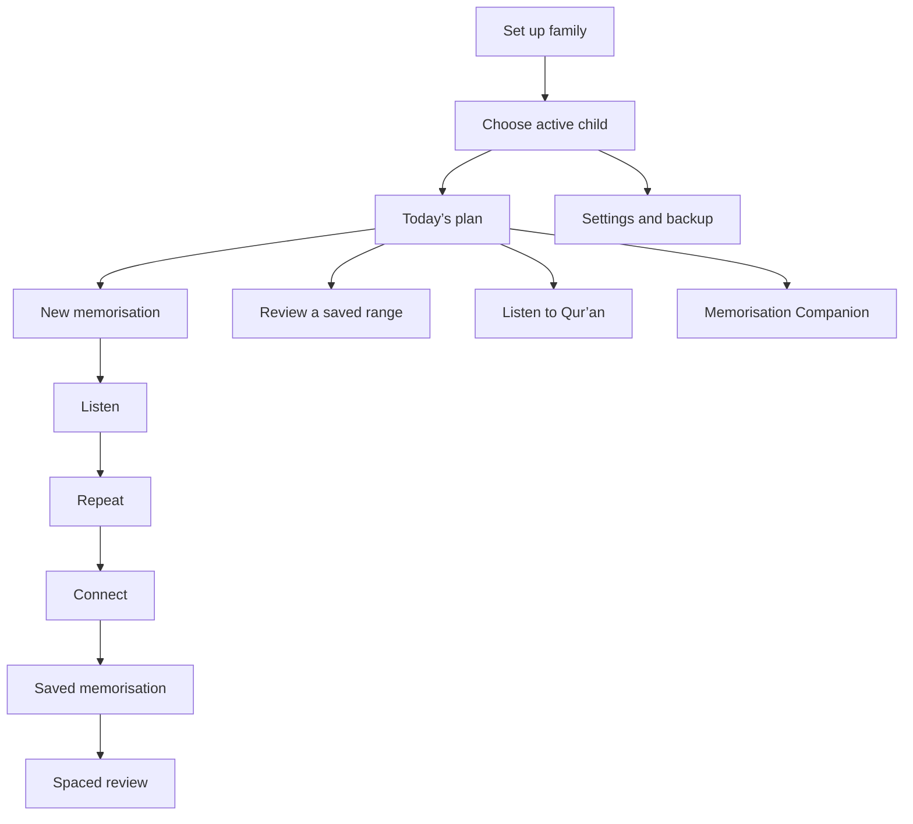

# Wali Tahfiz — Product and Design Guide

## What this app is for

Wali Tahfiz helps families build a warm Qur’an memorisation habit at home. It starts with Al-Fatihah and Juz 30. A parent or guardian stays in charge of the session; the app simply makes the next small step clear.

The goal is not to collect the most memorisation. The goal is for a child to feel safe, supported, and close to the Qur’an.

## People we design for

- **Parent or guardian:** sets up the family, chooses a child, creates targets, plays audio, and records how a session went.
- **Child:** has a separate profile, memorised ranges, targets, repeat settings, and review schedule.

One family can have more than one child. Switching the active child must never show another child’s targets or memorisation by mistake.

## Product rules

1. Be kind, never demanding. A tired or upset child can pause without losing progress.
2. Prefer one short action over a long to-do list.
3. Help the adult lead the session. Do not try to replace their voice, judgement, or care.
4. Make today’s plan and the next action easy to see.
5. Keep personal data on the device by default.
6. Work well on a phone first, then use extra tablet and desktop space thoughtfully.

## Main journey

## Key screens and features

| Screen | What it does |
| --- | --- |
| Family setup | Choose how the adult is addressed, add one or more children, select each child’s icon, age, and surahs already memorised. A JSON backup can also be restored here. |
| Home | Shows the active child, today’s targets, progress counts, saved memorisation, reviews that are ready, audio shortcut, Settings, and the Memorisation Companion. |
| Add target | Creates either a new memorisation target or a review target. A new target can be one verse or a valid verse range. |
| New memorisation | Leads the family through Listen, Repeat, and Connect. The current place is saved so the family can stop and return later. |
| Review | Shows a random verse and the next verse. The guardian can play either one, shuffle the prompt, then record whether it was smooth or needs another try. |
| Listen to Qur’an | Provides Al-Fatihah and Juz 30, Arabic text, translation, reciter choice, per-verse repeat, range playback, and playback controls. |
| Memorisation Companion | Asks about the child’s mood and offers one small, gentle action: pause, listen, review, start a target, or make a new target. Local advice always works; AI advice is optional. |
| Settings | Manages language, light/dark theme, guardian greeting, child profiles, practice repeats, reciter, backup import/export, welcome prompt, and full local-data reset. |

## New memorisation flow

Keep the session short and clear. For each verse, use these three steps:

| Step | Plain-language instruction | Behaviour |
| --- | --- | --- |
| Listen / talaqqi | Listen to the reciter together. | Plays the verse for the child’s configured number of repeats. |
| Repeat / tikrar | The adult reads slowly; the child repeats. | The adult taps the counter after each round. |
| Connect / rabt | Help the child join the verses together. | Used after later verses and again for a completed surah range. |

The app lets each child have their own repeat count for these steps. A one-verse target can finish after the Repeat step. For long surahs, Connect is split into blocks of up to ten verses, with a small joining step between blocks.

The family can choose **Finish for today** at any point. Keep the session state and let them resume it later. Do not use failure language.

When a new target is complete, save it as a memorised range for that child. If the child has now covered a full surah through saved ranges, offer a full-surah connection practice first.

## Review and spacing (Murojaah Hafalan Tersimpan)

Jadwal Spaced Review (pengulangan berkala) berlaku khusus untuk **hafalan yang sudah tuntas tersimpan** (*memorised ranges*), bukan saat proses hafalan baru. Setiap rentang hafalan tersimpan mendapatkan jadwal murojaah otomatis:

`1 day → 3 days → 7 days → 14 days → 30 days`

- **Smoothly done** moves the range to the next interval.
- **Try again** starts the interval again from the beginning.
- Use friendly labels such as “Ready to review” and “In 3 days.” Never say “overdue” or imply failure.
- Offer only a small number of review suggestions at once. The adult can add one to today’s plan.

In review, show the question verse and then the next verse as the answer. Give the child time before revealing or playing the answer. A one-verse range should explain that it has no following verse rather than showing a broken state.

## Listening experience

The listening page covers Al-Fatihah and all of Juz 30. It should:

- Search by surah number, Latin name, or Arabic name.
- Show Arabic text right-to-left and a translation in the selected app language.
- Let the user choose a reciter. Ayman Sowaid is the default.
- Let the user repeat each verse 1, 2, 3, or 5 times.
- Let the user turn on a verse range, choose its start and end, and repeat that range 1, 2, 3, or 5 times.
- Offer play/pause, previous, next, and replay controls with a clear active state.
- Include Bismillah before applicable surahs and continue through the next Juz 30 surah when ordinary playback reaches the end.
- Save listening choices on the device.

Qur’an text, translations, and audio need an internet connection. The installed app shell can still open offline.

## Memorisation Companion

The companion starts from the child’s present condition, not a productivity target. Supported check-ins include upset, not in the mood, wants to play, tired, and ready to learn.

| Situation | Helpful response |
| --- | --- |
| Upset, tired, or not ready | Suggest a pause, calm presence, or a cuddle. Do not suggest a new target. |
| Wants to play | Suggest gentle recitation in the background. |
| Review is ready | Suggest one short range to review. |
| No memorisation yet | Suggest 1–2 verses of Al-Fatihah. |
| Child is ready | Suggest only one suitable next action. |
| Today is complete | Appreciate the effort and keep any next action light. |

The companion also provides a direct action button **"Catat Hafalan Hari Ini (Tanpa Program)"** so guardians can log new memorisation or review practiced independently today without having to launch the full guided step-by-step practice session.

The local recommendation must always be useful. If `OPENAI_API_KEY` is present on the server, the app can request a short personalised version from `/api/daily-coach`. The AI must use the same action chosen by the local rule, stay brief, avoid diagnoses and guilt, and never tell users it is AI. If the request fails, keep showing local advice.

## Data, backup, and privacy

Use IndexedDB for the family profile, child profiles, daily targets, memorised ranges, listening preferences, language, and companion check-ins. Session-only practice routing may use session storage.

The app should keep data separated by child ID. Deleting a child removes that child’s targets, saved memorisation, and check-ins only after clear confirmation.

Provide JSON export and import so a family can move to another device. Validate imports before writing them. A full reset needs a confirmation and must make it clear that an export is the only way to keep a copy.

By default, no family data is sent to an app server. Qur’an text, translations, and reciter audio come from public Qur’an services as needed. Optional AI advice is the only feature that contacts the app’s server endpoint; the API key stays in the server environment.

## Language, theme, and installation

- Support Bahasa Indonesia and English throughout the interface.
- Save the chosen language on the device; `VITE_APP_LOCALE` can set the first default to `id` or `en`.
- Offer light and dark themes and save the choice on the device.
- Make the browser install prompt easy to understand, including clear iOS “Add to Home Screen” instructions.
- Cache the app shell so an installed app can open without a network connection. Be honest when Qur’an text or new audio still needs internet access.

## Light and Dark Theme System

The design uses a warm, organic color system inspired by nature (Forest, Sage, Cream, Peach, Terracotta) to create a serene environment for spiritual study. Light and dark modes are treated as equal design surfaces, keeping identical visual hierarchy and contrast guarantees across both themes.

### Theme Palette & CSS Variables

| Token | Semantic Role | Light Mode Value | Dark Mode Value |
| --- | --- | --- | --- |
| `--color-canvas` | Base page background | HSL `43 100% 97%` (`#FDFBF7`) | HSL `154 22% 9%` (`#0C1311`) |
| `--color-surface` | Primary card / container | HSL `0 0% 100%` (`#FFFFFF`) | HSL `155 20% 13%` (`#16211E`) |
| `--color-surface-raised` | Raised element / modal sheet | HSL `86 33% 98%` (`#F7FAF4`) | HSL `155 18% 16%` (`#1A2824`) |
| `--color-surface-muted` | Subtitle / background fill | HSL `106 29% 95%` (`#EFF6EB`) | HSL `153 17% 19%` (`#131F1C`) |
| `--color-forest` | Main brand action / title | HSL `144 37% 31%` (`#47775C`) | HSL `137 42% 70%` (`#89D4A7`) |
| `--color-sage` | Secondary fill / border / badge | HSL `120 30% 88%` (`#DCEBDC`) | HSL `140 23% 28%` (`#305C41`) |
| `--color-peach` | Warm accent / rosette background | HSL `32 100% 88%` (`#FFE5C4`) | HSL `33 75% 72%` (`#F4C38A`) |
| `--color-terracotta` | High-signal focus / active accent | HSL `21 65% 30%` (`#BD6F45`) | HSL `20 75% 75%` (`#F2A882`) |
| `--color-ink` | Primary text / body content | HSL `153 20% 20%` (`#293B33`) | HSL `126 25% 93%` (`#E6F4EC`) |
| `--color-muted` | Muted copy / captions | HSL `153 20% 25%` (`#334155`) | HSL `139 20% 80%` (`#B3D1C1`) |
| `--color-border` | Subtle structural dividers | HSL `126 23% 78%` (`#C0DCC0`) | HSL `149 15% 29%` (`#3C584A`) |

### Surface Styling & Elevation

- **Light Theme Surface:** Features a double radial ambient background gradient (`hsl(var(--color-sage) / .62)` at top-left, `hsl(var(--color-peach) / .28)` at top-right). Cards use `bg-white` with multi-layered soft shadows (`box-shadow: 0 18px 55px rgba(71,119,92,.10), 0 2px 5px rgba(71,119,92,.04)`).
- **Dark Theme Surface:** Replaces elevation shadows with soft emerald-tinted borders (`border border-emerald-900/40`) on deep dark green surfaces (`#0C1311` canvas, `#16211E` card surface, `#1A2824` raised panels). This eliminates OLED harsh glare while retaining spatial depth.
- **Glassmorphism:** Coach panels and sticky bottom nav bars use `backdrop-blur-md` with `bg-white/95` (light) and `bg-[#0C1311]/90` (dark) to maintain context during scroll.

### Contrast Matrix & Accessibility (WCAG AA)

- **Body Text:** Primary body text (`--color-ink`) maintains at least a 7:1 contrast ratio against `--color-canvas` and `--color-surface` in both light and dark modes.
- **Secondary & Muted Copy:** Muted text (`--color-muted`) maintains at least 4.5:1 contrast ratio.
- **Large Headlines & Icons:** Headers (`--color-forest`) and key interactive icons maintain a minimum 3:1 ratio (exceeding 4.5:1 on standard backgrounds).
- **Interactive State Pairs:** When elements hover, focus, or activate, text and background colors are adjusted together as a pair. Contrast never decreases on hover/active states.
- **Color Independence:** Status is never communicated by color alone. Every badge or state combines color with an explicit text label (e.g., "Ready for review", "In 3 days") or distinct visual mark.

### Dynamic PWA Theme Synchronization

Theme switches apply immediately across the entire DOM tree:
1. `document.documentElement` and `document.body` both toggle the `.dark` class.
2. `data-theme` attribute and `color-scheme` style property update to `light` or `dark`.
3. `<meta name="theme-color">` updates dynamically (`#FDFBF7` in light mode, `#0C1311` in dark mode) so the OS browser header and PWA status bar seamlessly match the app frame.
4. Preference is saved to `localStorage` under key `wali-tahfiz:theme` and defaults to system preference (`prefers-color-scheme: dark`) when first unconfigured.

## Animation and Motion System

Motion in Wali Tahfiz is designed to feel physical, organic, and peaceful. Animations guide the child and parent between steps without inducing excitement or urgency.

### Motion Principles

1. **Spatial Continuity:** Components expand or slide from their originating point (e.g., bottom sheets slide from the bottom edge; coach panel pops up from the floating FAB).
2. **Short & Decisive:** Micro-interactions execute within 150–200ms so the interface responds instantly without lagging behind touch inputs.
3. **Calming Easing:** Use smooth cubic-bezier curves (`cubic-bezier(0.2, 0, 0, 1)`) with zero bounce or exaggerated wobble.
4. **Performance First:** Animate GPU-accelerated CSS properties only (`transform` and `opacity`). Never animate `width`, `height`, or `margin` layout properties directly.

### Core Motion Specifications

| Motion Type | Class / Keyframes | Duration & Easing | Behaviour & Trigger |
| --- | --- | --- | --- |
| **Tactile Tap / Press** | `active:scale-[0.96]` | 150ms `cubic-bezier(0.2,0,0,1)` | Applies to all primary buttons, cards, choice chips, and back controls to simulate physical tactile response. |
| **Phase Transition** | `.phase-in` / `@keyframes phase-in` | 320ms `cubic-bezier(0.2,0,0,1)` | Smooth 8px vertical upward slide and opacity fade-in when switching between Talaqqi, Tikrar, and Rabt steps. |
| **Coach Sheet Entrance** | `.coach-panel` / `@keyframes coach-in` | 220ms `cubic-bezier(0.2,0,0,1)` | Slide up from bottom with subtle scale expansion (`scale(0.98)` to `scale(1)`). |
| **PWA Install Prompt** | `.pwa-install-prompt` / `@keyframes pwa-install-in` | 260ms `cubic-bezier(0.2,0,0,1)` | Floating entrance from bottom right edge (`translateY(8px)` to `translateY(0)`). |
| **Chat Message Bubble** | `.coach-message` / `@keyframes coach-message-in` | 180ms `cubic-bezier(0.2,0,0,1)` | Staggered fade and slide for companion advice responses. |
| **Ambient Attention** | `.coach-pulse` / `@keyframes coach-pulse` | 1.8s `ease-in-out infinite` | Gentle scale pulse (`scale(1)` to `scale(1.35)`) with opacity ring for the companion prompt notification dot. |
| **Progress Fill** | `.parent-record-fill` | 300ms `ease-out` | Smooth width percentage transition on repetition progress bars when guardian taps repeat count. |
| **Ayah Card Hover** | `.ayah-card:hover` | 200ms `ease` | Subtle `-translate-y-0.5` lift with enhanced shadow on desktop devices with hover support. |

### Accessibility & Reduced Motion

The app honors user device motion accessibility settings via `@media (prefers-reduced-motion: reduce)`:
- Sets `transition-duration: 0ms` for all cards, buttons, panels, phase containers, and progress bars.
- Disables `@keyframes` animations (`phase-in`, `coach-in`, `pwa-install-in`, `coach-pulse`).
- Instant state changes occur without visual movement or displacement, preventing motion sickness or distraction.

## UI/UX Architecture and Interaction Craft

Wali Tahfiz pairs child-friendly simplicity with clear adult controls. Layouts are designed mobile-first, ensuring high comfort on small touch screens while taking advantage of tablet and desktop viewports.

### Typography Stack & Hierarchy

| Usage | Font Family | Fallback Stack | Sizing & Styling |
| --- | --- | --- | --- |
| **Headings & Display** | **Fredoka** | `Arial Rounded MT Bold`, `sans-serif` | Friendly, rounded weight (500–700). Sized 24px–36px (`text-2xl` to `text-4xl`). |
| **UI & Body Copy** | **DM Sans** | `system-ui`, `-apple-system`, `Segoe UI`, `Arial`, `sans-serif` | Clean, highly legible sans-serif (400–700). Base body 14px–16px, captions 11px–12px with high letter-spacing. |
| **Qur'anic Verses (RTL)** | **Amiri Quran** | `'Amiri'`, `serif` | Embedded WOFF2 Arabic font. Sized generous 28px–34px on phone, 36px–44px on tablet/desktop. Line-height fixed to `2.2`, `font-synthesis: none`, `font-variant-ligatures: common-ligatures contextual`, `text-rendering: optimizeLegibility`. |

### Ergonomics & Touch Target Budget

- **Minimum Touch Target:** Every interactive element (buttons, chips, checkboxes, icon controls, ayah cards) has a touch surface of at least `44 × 44 px`.
- **Primary CTA Height:** Main action buttons (`.primary-button`, `.primary-button-audio`) have a minimum height of `48px` to `56px` with rounded 18px–24px corners.
- **Safe Area Management:** Fixed floating elements (Coach FAB, Settings save bar, PWA install toast) respect OS safe area padding (`env(safe-area-inset-bottom)`).
- **Focus Rings:** All keyboard-focusable controls feature high-contrast focus rings (`focus-visible:ring-2 focus-visible:ring-emerald-600 focus-visible:ring-offset-2`).

### Child-First & Non-Punitive UX Philosophy

- **Warm Vocabulary:** Avoid industrial or gamified terminology. Use terms like *Wali* (guardian), *Anak* (child), *Hafalan* (memorization), *Murojaah* (review), *Lancar* (fluent), and *Siap diulang* (ready for review).
- **No Pressure:** Do not include streaks, leaderboards, timers, late warnings, or red error banners. If a session is interrupted, offer "Finish for today" ("Selesai dulu hari ini") and preserve progress state.
- **Guardian Control:** The adult makes evaluation decisions (recording whether recitation was smooth or needs another try). The adult guides the session.

### Iconography & Visual Assets

- **Lucide SVG Icons:** Built-in vector icons (`lucide-react`) are used for functional controls (Navigation, Audio Playback, Settings, Add, Trash).
- **No Action Emojis:** Emojis are reserved strictly for child profiles and mood check-in illustrations. Functional buttons always use crisp SVG icons.
- **Accessible Labels:** Icon-only buttons must provide an explicit `aria-label` attribute describing the exact action (e.g., `aria-label="Kembali ke beranda"`, `aria-label="Putar audio ayat"`).

### PWA Offline & Installation Experience

- **Offline First Shell:** App shell assets (HTML, CSS, JS bundle, fonts) are cached via Service Worker so the PWA opens instantly without an active network connection.
- **Graceful Network Boundaries:** Audio recitations and live Qur'an verse fetching show clear, friendly inline status indicators when internet connectivity is required.
- **Unobtrusive Install Prompt:** The install banner appears as a soft floating toast at the bottom right. On iOS devices, it provides clear step-by-step visual guidance for "Add to Home Screen" via Safari share menu.

## Responsive Layout Architecture

| Width Breakpoint | Layout Strategy |
| --- | --- |
| **Phone (<640px)** | Single-column linear layout. 16px page padding. Full-width cards. Controls wrap cleanly. Modals and coach conversations open as bottom sheets. |
| **Tablet (640px - 1023px)** | Expanded padding (24px). Two-column card grids for surah catalogue and target choices. Home hero switches to split header and child switcher layout. |
| **Desktop (≥1024px)** | Home screen uses two-column split (Main plan & targets on left ~65%, Saved memorization & stats on right ~35%). Practice screens remain centered and comfortably narrow (max 768px) to minimize eye fatigue during recitation. |

## Practical acceptance checks

- A new guardian can add at least one child and arrive at the home screen without guessing what to do next.
- Each child sees only their own targets, memories, repeat settings, and check-ins.
- A target can be created in four choices or fewer: type, surah, range, save.
- Every practice step says what to do now and how far the family has come.
- Stopping a practice session does not lose its place.
- A completed new target becomes a saved range with a future review date.
- Review ends with one clear result: smooth or try again.
- Audio clearly shows what is playing and can be paused, replayed, or moved between verses.
- The companion never pushes a tired or upset child to continue.
- Backup import/export, language, theme, and reciter choices work without affecting another child’s learning data.
- Light and dark themes switch seamlessly, updating colors, shadows, borders, text contrast, and system status bar meta colors.
- Animations run smoothly at 60fps on mobile without layout thrashing, and respect prefers-reduced-motion.
- The app remains comfortable at 320px wide and does not make Arabic text or audio controls scroll sideways.
